# Findings：主动回复预占（proactive reply reservation）状态机全貌

> Wayfinder 研究 ticket [R1 — 预占生命周期全调用路径与状态字段事实清单](https://github.com/Derbay32/komari-bot-nonebot/issues/43) 的调查产出。
> 调查范围：`komari_bot/plugins/komari_chat`（handlers/message_handler.py、\_\_init\_\_.py、repositories/reply_commit_repository.py）、`komari_bot/plugins/komari_memory`（services/redis_manager.py、services/redis_keys.py、config_schema.py）、`migrations/versions/0001_baseline_full_schema.py`、`migrations/versions/0002_typed_plugin_config_tables.py`。调查基线：branch `dev`，HEAD `caeef4e`，全程只读。

## 1. 完整调用路径

### 1.1 `_attempt_reply` — 预占/心跳/续租/finally 释放（message_handler.py:1505-1753）

- 签名返回契约：`(PendingReply | None, bool, ReplyFailureInfo | None)`，文档注释明确"频控冷却/超限/重复等正常控制流返回 (None, False, None)"（message_handler.py:1520-1527）。
- 局部状态初始化：`reservation_id=None`、`reservation_transferred=False`、`reservation_heartbeat=None`、`reservation_lost=asyncio.Event()`、`reaction_sent=False`（message_handler.py:1529-1534）。
- **预占只发生在非强制回复**：`if not force_reply:`（message_handler.py:1536）。`force_reply=False` 且 `config.proactive_enabled` 为假时直接 `return None, False, None`，不产生失败信息、不贴表情（message_handler.py:1537-1538）。强制回复（`force_reply=True`）完全不触碰预占（reservation_id 保持 None，1536 分支整体跳过）。
- **预占 ID = 平台消息 ID**：`reservation_id = str(message.message_id)`（message_handler.py:1540）。
- **reserve 调用**（message_handler.py:1542-1547）：`self.redis.reserve_proactive_reply(group_id, reservation_id, max_per_hour=config.proactive_max_per_hour, reservation_ttl_seconds=config.proactive_reservation_ttl_seconds)`。`asyncio.CancelledError` 直接 re-raise（1548-1549）；其他异常 → `ReplyFailureInfo(stage="reserve", reaction_sent=False)`（1550-1557）。
- **reserve 状态分支**（message_handler.py:1558-1577）：
  - `"reserved"` → pass，继续
  - `"cooldown"` / `"rate_limited"` / `"duplicate"` → `return None, False, None`（正常控制流，无失败通知；1561-1569）
  - 未知状态 → `ReplyFailureInfo(stage="reserve", error_type="UnknownReservationStatusError")`（1570-1577）
- **心跳启动**（message_handler.py:1578-1585）：`asyncio.create_task(self._proactive_reservation_heartbeat(group_id, reservation_id, reservation_ttl_seconds=config.proactive_reservation_ttl_seconds, lost=reservation_lost))`。
- **try 主体**（1587-1746）：
  - `_read_buffers`（1589-1605）：失败 → `ReplyFailureInfo(stage="read_buffers")`——注意此分支发生在贴表情之前，`reaction_sent=False`（1604）。
  - **贴表情**：`reaction_sent = self._schedule_reply_reaction(on_reply_triggered)`（1608；`_schedule_reply_reaction` 定义 612-630，仅当 callback 非空且 `face_reaction_enabled` 且 `face_reaction_id` 才返回 True，任务挂 `self._reaction_tasks` 防 GC）。
  - 创建 collector（1611-1625），`input_data` 含 `"reason": reason`、`"reply_score": reply_score`（1621-1622）。
  - `_generate_reply_core(..., _reason=reason, _reply_score=reply_score, ...)`（1626-1640）。
  - `CancelledError` → finalize collector `"cancelled"` 后 re-raise（1641-1647），由 finally 释放预占。
  - `_FavorabilityReadError` → `ReplyFailureInfo(stage="generate", reaction_sent=reaction_sent)`（1648-1660）；其他异常同（1661-1673）；成功则 finalize `"success"`（1674-1679）。
  - 空回复 → `EmptyReplyError`（1681-1695）；`favorability_delta is None` → `FavorabilityDeltaMissingError`（1697-1705）。
  - **生成完成后的最终续租检查**（1707-1723）：`renew_proactive_reply`，若 `reservation_lost.is_set()` 或未续上 → `ReplyFailureInfo(stage="generate", error_type="ProactiveReservationLostError")`（不发送）。
  - 构造 `PendingReply`（1731-1744，`proactive_reservation_id=reservation_id` 于 1743），置 `reservation_transferred=True`（1745），`return pending_reply, stored, None`（1746）。
- **finally**（1747-1753）：停心跳任务（`_stop_background_task`，1180-1186）；`if reservation_id is not None and not reservation_transferred:` → `_release_proactive_reservation`（尽力释放，失败仅记日志，1477-1493）。即：**所有失败/取消/提前 return 路径都会释放预占；只有成功转移到 PendingReply 才保留预占**。
- 注意：`_attempt_reply` 返回后心跳已停止，prepare/send/outbox 处理窗口不再续租，依赖 TTL（默认 360s）覆盖。

### 1.2 `_proactive_reservation_heartbeat`（message_handler.py:1755-1779）

- `interval = max(1.0, reservation_ttl_seconds / 3)`（1764）；循环 `sleep → renew_proactive_reply`；renew 抛异常 → 记日志 + `lost.set()` + return（1773-1776）；renew 返回 False → `lost.set()` + return（1777-1779）。**心跳失败只置事件，不主动释放**——由生成完成后的最终续租检查（1707-1723）或 finally 兜底。

### 1.3 `prepare_pending_reply` — outbox 写入（message_handler.py:1119-1148）

- 前置校验 `favorability_delta is None` → `ValueError`（1121-1124）。
- 构造 `PendingReplyCommit`：`operation_id`（1127）、`source_message_id`（1129）、`group_id/user_id`（1130-1131）、`reply_content`（1134）、`reply_timestamp`（1135）、`favorability_delta/reason`（1136-1137）、`interaction_history` 三项子集（1138-1142）、**`proactive_reservation_id=pending_reply.proactive_reservation_id`（1143）**、**`proactive_cooldown_seconds=config.proactive_cooldown`（1144）**、`global_interaction_enabled/trigger_size`（1145-1146）。
- 返回 `reply_commit_repository.prepare(payload)`（1148）：活动 operation 已存在返回 False。

### 1.4 `handle_group_message` 编排（komari_chat/\_\_init\_\_.py:208-345）

- `process_message` 返回 `pending_reply`；空回复 → `discard_pending_reply`（\_\_init\_\_.py:247-251）。
- `prepare_pending_reply`（253-265）：返回 False → 日志"重复回复 operation 已存在" + `discard_pending_reply` + 提前 return（不取消既有 outbox 行）。
- 发送（267-299）：有 `reply_to_message_id` → `bot.call_api("send_group_msg")` 回复数组；`ActionFailed` → 降级 `matcher.send(plain_text_message(reply))`（278-286）；其他异常 → `delivery_outcome="unknown"` 后 re-raise（287-289）。无引用 → `matcher.send`（291-299）。`_extract_platform_message_id` 从响应取平台 ID（140-152）。
- 成功后：`delivery_outcome="delivered"`、`reply_delivered=True`、`await handler.commit_delivered_reply(pending_reply, platform_message_id=...)`（300-305）。
- 异常分支（306-344）：`pending_reply is not None and not reply_delivered` 时——若 `delivery_outcome=="not_sent"` 且已 prepare → `cancel_prepared_reply`（尽力 try/except，310-320），然后 `discard_pending_reply`（321）；若 `"unknown"` → 只记日志"保留 PREPARED 记录待对账"（322-326），**不释放预占**。最后统一 `report_reply_failure`（330-344），`reaction_sent=pending_reply is not None and not reply_delivered`（342）。
- `discard_pending_reply`（message_handler.py:1495-1503）：仅释放预占（`proactive_reservation_id is None` 时直接返回），不触碰 outbox——outbox 取消失务由调用方 `cancel_prepared_reply` 单独做。

### 1.5 `commit_delivered_reply`（message_handler.py:1412-1475）

- **repository 路径**（1419-1447，实际恒走此路径——`__init__` 第 175 行恒创建 `ReplyCommitRepository`）：
  1. `repository.mark_delivered(operation_id, platform_message_id)`，False → `RuntimeError("回复已发送，但 outbox 无法标记为 DELIVERED")`（1421-1427）
  2. 有 `decision_payload` → `_log_decision`（1429-1430）
  3. `claim_operation(operation_id, owner_token=self._reply_commit_owner, lease_seconds=get_config().reply_commit_lease_seconds)`（1432-1436）
  4. 领取成功 → `_finish_claimed_reply_commit(record, owner_token)` **内联执行全部副作用**（1437-1441）
- **兜底直连确认路径**（1449-1475，仅当 repository is None 时可达）：`confirm_proactive_reply(group_id, reservation_id, cooldown_seconds=get_config().proactive_cooldown)`（1450-1455）→ `_log_decision`（1457-1458）→ `_commit_side_effects`（好感度/AI 存储/互动历史，1460-1465）。

### 1.6 `_process_claimed_reply_commit` — outbox 确认（message_handler.py:1221-1339）

- 启动 `_reply_commit_heartbeat`（1231-1239；心跳定义 1154-1178，`interval=max(1.0, lease_seconds/3)`）；`redis_dedupe_ttl_seconds = max(1, tombstone_retention_days+1) * 86400`（1240-1242）。
- **步骤 1 预占确认**（1244-1257）：`proactive_confirmed_at is None` 时——`reservation_id = record["proactive_reservation_id"]`，**非 None 才**调 `redis.confirm_proactive_reply(group_id, reservation_id, cooldown_seconds=int(record["proactive_cooldown_seconds"]))`（1247-1251）；随后无条件 `_mark_reply_commit_step(..., step="proactive_confirmed")`（1252-1257）——**reservation_id 为 NULL（强制回复）时跳过 Redis 调用但仍标记步骤完成**。
- 步骤 2 好感度（1259-1270）：`adjust_user_favorability(..., operation_id=f"{operation_id}:favorability")` + mark_step。
- 步骤 3 AI 历史（1272-1300）：构造 bot `MessageSchema`（`message_id=f"bot_{operation_id[-32:]}"`，1286）+ `push_message_once`（防重键 `chat_commit:{op}:ai_history`）+ mark_step。
- 步骤 4 互动历史（1302-1326）：`global_interaction_enabled` 为真才写 `push_global_interaction_once`（1314-1320）；**关闭时仍无条件 mark_step**（1321-1326）。
- 完成前租约检查（1328-1330）→ `repository.complete`（1331-1337，失败 → RuntimeError）→ finally 停心跳（1338-1339）。
- `_mark_reply_commit_step`（1188-1207）：`lease_lost` 已置 → RuntimeError；`mark_step` 失败 → RuntimeError。
- `_finish_claimed_reply_commit`（1341-1375）：异常 → `mark_failure(error_code=type(error).__name__, max_attempts=config.reply_commit_max_attempts, retry_base_seconds=config.reply_commit_retry_base_seconds)`，`FAILED` 记 error 日志（保留对账），否则 warning（已安排重试）。

### 1.7 后台轮询 `_reply_commit_worker`（komari_chat/\_\_init\_\_.py:84-121）

- 循环：`_get_or_build_handler()` → `handler.retry_pending_reply_commits()` → `interval = get_config().reply_commit_worker_interval_seconds`（84-91）；`CancelledError` re-raise（92-93）；其他异常 → 日志 + `interval=5`（94-96）；`await asyncio.sleep(max(1, interval))`（97）。
- 启动/停止：`driver.on_startup(_start_reply_commit_worker)`、`driver.on_shutdown(_stop_reply_commit_worker)`（119-121）；`_start` 仅在任务为 None 或已完成时创建（100-104）；`_stop` cancel + await（107-116）。
- `retry_pending_reply_commits`（message_handler.py:1377-1410）：`claim_pending(owner_token=self._reply_commit_owner, limit=config.reply_commit_batch_size, lease_seconds=config.reply_commit_lease_seconds)`（1380-1384）→ 逐个 `_finish_claimed_reply_commit`（1386-1391）→ 每小时（`time.monotonic()` 距 `_last_reply_commit_cleanup` ≥3600）执行 `cleanup_tombstones` + `user_data_plugin.cleanup_favorability_operations`（1393-1409）。`_reply_commit_owner = f"chat-{uuid.uuid4().hex}"` 每次构建（176）。

### 1.8 `process_message` 前置去重（message_handler.py:539-549）

- 生成前查 `reply_commit_repository.has_active_operation(operation_id)`（`status <> 'CANCELLED'` 即存在，539-543），命中 → 日志"重复平台事件已有回复 operation，跳过生成" + `return None`（544-549）。
- 返回值经 `replace(pending_reply, decision_payload=...)` 注入决策载荷（568-581）。

## 2. Lua 原语语义（redis_manager.py）

### 2.1 常量与键

- `_PROACTIVE_RATE_WINDOW_MS = 3_600_000`（1 小时滑动窗口，redis_manager.py:40）、`_PROACTIVE_SLOTS_TTL_GRACE_MS = 60_000`（41）。
- 键（redis_keys.py:35,38）：`komari_memory:proactive:cd:{group_id}`（STRING，冷却）、`komari_memory:proactive:slots:{group_id}`（ZSET，滑动窗口名额）。
- ZSET 成员：`pending:{reservation_id}`（score = 到期毫秒时间戳 = now + ttl）、`confirmed:{reservation_id}`（score = now + 1h）。冷却键值：预占期存裸 `reservation_id`，确认后存 `"confirmed:" .. reservation_id`。

### 2.2 `reserve_proactive_reply`（脚本 42-73，wrapper 1067-1110）

- 参数：`(group_id, reservation_id, max_per_hour, reservation_ttl_seconds)`；`slots_ttl_ms = max(3_600_000, ttl_ms) + 60_000`（1084-1087）。
- 脚本逻辑：`ZREMRANGEBYSCORE` 惰性剪除过期成员 → 若 pending/confirmed 成员已存在 → **return 3（duplicate）** → 冷却键存在 → **return 1（cooldown）** → `ZCARD >= max_slots` → **return 2（rate_limited）** → 否则 `ZADD pending 成员(score=now+ttl)` + `PEXPIRE slots键` + `SET cooldown键=reservation_id PX ttl` → **return 0（reserved）**。
- wrapper 映射 0/1/2/3 → `"reserved"/"cooldown"/"rate_limited"/"duplicate"`，未知码抛 `RuntimeError`（1099-1110）。**注意**：预占即写冷却键（值=裸 id），因此生成期间冷却键存在——这正是日志"冷却或生成预占中"（message_handler.py:1562）同态的原因：**同群主动回复在生成期间即被串行阻断**。
- 容量检查在冷却检查之后；重复成员检查最先。

### 2.3 `confirm_proactive_reply`（脚本 74-109，wrapper 1112-1145）

- 参数：`(group_id, reservation_id, cooldown_seconds)`；脚本内 `slots_ttl = 3_600_000 + 60_000`（1134 传入）。
- 脚本逻辑：剪枝 → 已存在 confirmed 成员 → **return 2**（幂等，已确认）→ `ZREM pending 成员`、`ZADD confirmed 成员(score=now+1h)`、`PEXPIRE slots键`；冷却键：不存在或等于裸 id → `SET "confirmed:" .. id PX cooldown_ttl`；**返回 had_pending**（pending 成员是否曾存在）。
- wrapper：code 0 → warning"预占已过期，按已送达补记"（**此时 confirmed 成员与冷却仍已写入**，1138-1142）；1/2 正常；其他 → RuntimeError（1143-1145）。
- 冷却键已被他方占用（值既非裸 id 也非空）时不覆盖——同群冷却由先确认者持有。

### 2.4 `renew_proactive_reply`（脚本 110-137，wrapper 1147-1174）

- 参数：`(group_id, reservation_id, reservation_ttl_seconds)`。
- 脚本逻辑：剪枝 → confirmed 成员存在 → **return 2（视为成功）** → pending 成员不存在 → **return 0（失败，租约已失）** → 否则 `ZADD pending(score=now+ttl)`、`PEXPIRE slots键`；冷却键等于裸 id → 一并 `PEXPIRE ttl`（**续租同时延长阻断**）→ **return 1**。
- wrapper：`return code in {1, 2}`（1170-1174），即"已确认记录同样视为成功"。

### 2.5 `release_proactive_reply`（脚本 138-150，wrapper 1176-1198）

- 脚本逻辑：`ZREM pending 成员`；冷却键等于**裸 id** → `DEL`；返回 removed 数。
- wrapper：返回是否移除了待确认名额（`> 0`）。**只删 pending、不删 confirmed**；冷却键值为 `"confirmed:"..id` 或其他时不动——重复释放安全。

### 2.6 滑动窗口记账与孤儿淘汰

- 窗口记账：`ZCARD(slots)` 在每次脚本调用前先 `ZREMRANGEBYSCORE -inf now`，因此**计数 = 当前未过期的 pending + confirmed 成员数**（含"生成中"与"已送达"两类）；上限 `max_slots = max(1, proactive_max_per_hour)`（1095）。`get_proactive_count`（脚本 151-159，wrapper 1200-1215）同语义，但**全仓库无生产调用方**（仅定义）。
- 孤儿淘汰：**纯 TTL + 惰性裁剪**，无主动回收器——pending 成员按 ZSET score 过期、冷却键 PX 过期、slots 键 `PEXPIRE(max(1h, ttl)+60s)` 兜底整键过期；任何一次脚本调用都会裁剪已过期成员。进程崩溃后的孤儿预占即由此淘汰。

## 3. outbox 表字段（`komari_chat_reply_commit_outbox`）

### 3.1 表结构与字段（迁移 0001_baseline_full_schema.py:936-990）

- 主键 `operation_id TEXT`；`payload_hash`（载荷指纹）；`request_trace_id`；`source_message_id`；`platform_message_id`（可空）；`group_id/user_id/user_nickname/bot_nickname`；`reply_content`（可空）；`reply_timestamp DOUBLE PRECISION`；`favorability_delta INT`；`favorability_reason`；`interaction_history JSONB`；**`proactive_reservation_id TEXT`（可空，951）**；**`proactive_cooldown_seconds INT CHECK (>=0)`（952-954）**；`global_interaction_enabled BOOLEAN`；`global_interaction_trigger_size INT CHECK (>0)`；**`status TEXT CHECK IN ('PREPARED','DELIVERED','PROCESSING','COMPLETED','CANCELLED','FAILED')`（959-964）**；**`proactive_confirmed_at TIMESTAMPTZ`（965）** + `favorability_applied_at`/`ai_history_stored_at`/`interaction_stored_at`（966-968）；`attempt_count`；`next_retry_at`；`lease_owner`；`lease_expires_at`；`last_error_code`；`created_at`/`delivered_at`/`completed_at`/`updated_at`。索引 `idx_komari_chat_reply_commit_claim(status, next_retry_at, lease_expires_at, created_at)`（980-985）、`idx_komari_chat_reply_commit_cleanup(status, completed_at)`（986-989）。
- **无 SQLModel ORM 模型**：纯 raw SQL（asyncpg pool，`$n` 占位符），见 reply_commit_repository.py:1-4, 84-85；表列入迁移链测试白名单（tests/db/test_migration_chain.py:24）。

### 3.2 状态迁移路径（reply_commit_repository.py）

- **PREPARED 创建/复活**（`prepare`，103-175）：INSERT `status='PREPARED'`；`ON CONFLICT (operation_id) DO UPDATE ... WHERE status='CANCELLED'`——**仅 CANCELLED 行可被同一 operation 重置为 PREPARED**（清空 platform_message_id、四个步骤时间戳、attempt_count=0、next_retry_at、lease_owner/expires、last_error_code、delivered_at、completed_at；141-153）。COMPLETED/FAILED/DELIVERED/PROCESSING 行冲突时 DO UPDATE 被 WHERE 跳过 → 不返回行 → `prepare` 返回 False。
- **PREPARED → CANCELLED**（`cancel_prepared`，177-198）：`WHERE status='PREPARED'`；清空 bot_nickname/user_nickname/reply_content/favorability_reason/interaction_history/**proactive_reservation_id=NULL**/platform_message_id。
- **PREPARED → DELIVERED**（`mark_delivered`，200-248）：置 `delivered_at=COALESCE(...,NOW())`、`next_retry_at=NULL`；已存在 DELIVERED/PROCESSING/COMPLETED/FAILED → 幂等返回 True（243-248）；平台消息 ID 与已存值不一致 → `RuntimeError`（235-242）。
- **→ PROCESSING**（`claim_operation` 250-285 / `claim_pending` 287-333）：候选为 `DELIVERED 且 (next_retry_at IS NULL 或已到期)` 或 `PROCESSING 且 lease_expires_at <= NOW()`；领取时 `attempt_count+1`、设 `lease_owner`、`lease_expires_at=NOW()+lease_seconds`；批量版 `FOR UPDATE SKIP LOCKED` 按 `COALESCE(next_retry_at, delivered_at, created_at)` 排序（313-315）。
- **PROCESSING 续租**（`renew_lease`，335-358）：`WHERE status='PROCESSING' AND lease_owner=$2` 才续期。
- **PROCESSING 步骤标记**（`mark_step`，360-383）：`SET {column} = COALESCE({column}, NOW())`，幂等；`proactive_confirmed` → `proactive_confirmed_at`（23-28 映射表）。
- **PROCESSING → COMPLETED**（`complete`，385-416）：前置条件**四个步骤时间戳全部非空**（407-410）；同时清空敏感载荷（含 `proactive_reservation_id=NULL`，397）。
- **PROCESSING → DELIVERED（重试）或 FAILED**（`mark_failure`，418-460）：`attempt_count >= max_attempts` → `FAILED`（保留整行，last_error_code=LEFT(error,100)）；否则回 `DELIVERED` 且 `next_retry_at = NOW() + LEAST(base * 2^(attempt-1), 3600)`（指数退避，上限 1 小时）。
- **Tombstone 清理**（`cleanup_tombstones`，462-473）：只删 `COMPLETED/CANCELLED` 且 `updated_at < NOW()-retention_days`；**FAILED 永不自动清理/迁移**（留人工对账，见 1363-1367 日志文案）。
- `proactive_reservation_id`/`proactive_confirmed_at` 时序：prepare 写入（109-122）→ `_process_claimed_reply_commit` 内 Redis confirm + mark_step（message_handler.py:1244-1257）→ complete 前置条件（407）→ complete 清空 id（397）。

## 4. 跨段上下文载体

### 4.1 PendingReply（message_handler.py:125-141）

- 实际字段 **13 个**（R1 ticket 描述写"14 个"，按实际登记）：`reply`、`reply_to_message_id`、`message`、`reply_result`、`force_reply`、`bot_nickname`、`reason`、`reply_score`、`operation_id`、`request_trace_id`、`reply_timestamp`、`proactive_reservation_id`、`decision_payload`。
- 服务预占生命周期的字段：
  - `proactive_reservation_id`（140）——唯一直接载体：prepare 写入 outbox（1143）、兜底路径直连 confirm（1449-1455）、`discard_pending_reply` 释放（1497-1503）。
  - `operation_id`（137）——outbox 主键与 Redis 防重键身份：prepare（1127）、cancel（1152）、mark_delivered（1422）、claim（1433）。
  - `message`（131）——`group_id` 供 confirm/release（1451-1453、1500-1502），`message_id` 作 `source_message_id`（1129）。
  - `reply_timestamp`（139）——写入 outbox（1135），供 AI 历史/互动记录回填时间戳（1285、1311）。
  - `force_reply`（133）——间接决定是否产生预占（1536）。
  - `reason`/`reply_score`（135-136）——仅日志/诊断（1726-1730、1467-1475），不参与生命周期。
  - `decision_payload`（141）——送达后 `_log_decision`（1429-1430、1457-1458）。

### 4.2 `_generate_reply_core` 死参数 `_reason`/`_reply_score`

- 仅存在于：签名声明（message_handler.py:814-815）与两处调用点传参（1635-1636 传 `reason`/`reply_score`；1897-1898 传 `"direct_call"`/`None`）。**函数体 824-1065 对二者零引用**（全文件精确检索确认：814、815、1635、1636、1897、1898 六处之外无其他出现；其余命中均为 `favorability_reason`/`forced_reply_reason` 等不同标识符）。
- 真实值的平行传播链：`_attempt_reply` 的 `reason`/`reply_score` 另经 collector `input_data`（1621-1622）与 `PendingReply`（1738-1739）传递；`reason` 还用于 `process_message` 的 `AttemptReplyReason` 派生（551-553）与失败通知（\_\_init\_\_.py:344）。

### 4.3 `reaction_sent` 传播路径（仅登记事实）

1. `_attempt_reply` 初始化 `False`（1534）；`_schedule_reply_reaction` 返回值赋值（1608；调度条件见 620-626——callback 非空 + `face_reaction_enabled` + `face_reaction_id`）。
2. 进入各 `ReplyFailureInfo` 构造：reserve 分支硬编码 `False`（1556，此时尚未贴表情）、read_buffers 分支 `False`（1604）、generate 异常/空回复/缺 delta/租约丢失分支用 `reaction_sent` 变量（1659、1672、1694、1704、1722）。
3. `ReplyFailureInfo.reaction_sent` 字段（156，docstring 146-150 定义"失败分流边界标志"）。
4. `report_reply_failure`（642-668）：`if failure.reaction_sent: send_group_reply_error_text(bot, event)`（655-656，固定文本引用原消息补发，error_notify.py:9,21-37）；SUPERUSER 通知无条件调用（657-666，内部另有 5 分钟同群同类型 Redis 冷却与 `error_notify_enabled` 开关，error_notify.py:40-100）。
5. `handle_group_message` 异常分支使用**不同推导式** `reaction_sent=pending_reply is not None and not reply_delivered`（\_\_init\_\_.py:342）——与 `_attempt_reply` 内"是否成功派发"的语义存在差异（如 `face_reaction_enabled=False` 但生成成功时：`_attempt_reply` 中为 False，此处为 True）。

## 5. 频控配置字段

### 5.1 定义位置（komari_memory/config_schema.py — 注意：komari_chat 无独立 config_schema，经 `komari_memory.services.config_interface.get_config()` 读 KomariMemoryConfigSchema，config_interface.py:21-35）

- `proactive_enabled: bool`（320-324，默认 False，`apply_mode: immediate`）
- `proactive_score_threshold: float`（325-331，默认 0.8，immediate）——**全仓库无运行时读取**（仅定义 + 迁移列 + 迁移脚本，见下）
- `proactive_cooldown: int`（332-338，默认 300，范围 5-3600，immediate，"主动回复送达后的冷却时间（秒）"）
- `proactive_max_per_hour: int`（339-345，默认 400，范围 1-800，immediate，"最近一小时最大主动回复次数（包含生成中的预占）"）
- `proactive_reservation_ttl_seconds: int`（346-352，默认 360，范围 30-900，immediate，"生成与发送阶段的 Redis 预占有效期（秒）"）
- `reply_commit_worker_interval_seconds: int`（355-360，默认 5，1-300）
- `reply_commit_batch_size: int`（361-366，默认 20，1-200）
- `reply_commit_lease_seconds: int`（367-372，默认 120，30-900）
- `reply_commit_max_attempts: int`（373-378，默认 20，1-100）
- `reply_commit_retry_base_seconds: int`（379-384，默认 5，1-300）
- `reply_commit_tombstone_retention_days: int`（385-390，默认 30，1-365）

### 5.2 全部读取位置

| 字段 | 读取位置 |
|---|---|
| `proactive_enabled` | message_handler.py:1537（`_attempt_reply` 预占总开关） |
| `proactive_cooldown` | message_handler.py:1144（prepare 写入 outbox）、1454（兜底路径 confirm） |
| `proactive_max_per_hour` | message_handler.py:1545（reserve） |
| `proactive_reservation_ttl_seconds` | message_handler.py:1546（reserve）、1582（心跳创建）、1711（最终续租）；经参数流入心跳 1768 |
| `reply_commit_worker_interval_seconds` | komari_chat/\_\_init\_\_.py:91（worker 轮询间隔） |
| `reply_commit_batch_size` | message_handler.py:1382（claim_pending limit） |
| `reply_commit_lease_seconds` | message_handler.py:1230（`_process_claimed_reply_commit`）、1383（retry 领取）、1435（commit_delivered 领取） |
| `reply_commit_max_attempts` | message_handler.py:1360（mark_failure） |
| `reply_commit_retry_base_seconds` | message_handler.py:1361（mark_failure） |
| `reply_commit_tombstone_retention_days` | message_handler.py:1241（Redis 防重 TTL 计算）、1396（tombstone 清理） |

- PG 列定义：迁移 0002_typed_plugin_config_tables.py:280-290（`proactive_enabled`/`proactive_score_threshold`/`proactive_cooldown`/`proactive_max_per_hour`/`proactive_reservation_ttl_seconds`/五个 `reply_commit_*`）；legacy 迁移输入源脚本 scripts/migrate_legacy_config_to_typed_tables.py:365-375。
- 相邻但独立的机制（不属于本状态机）：komari_decision 的 `social_bot_cooldown_seconds`/`social_timing_cooldown_max_penalty`（config_schema.py:77,92）仅作评分惩罚系数（social_timing_service.py:103-122），不读写 Redis 冷却键。

## 6. 现状状态机图

```mermaid
stateDiagram-v2
    direction LR

    state "Redis 预占层（per-group）" as redis {
        [*] --> Idle: 无预占
        Idle --> Reserved: reserve() 成功\n(ZADD pending:score=now+ttl;\nSET cd=reservation_id PX ttl)
        Idle --> Idle: reserve() 拒绝\ncooldown/rate_limited/duplicate
        Reserved --> Reserved: heartbeat renew() 每 ttl/3 秒\n(ZADD pending 续期; 冷却键同步续期)
        Reserved --> Lost: renew() 失败/异常\n(heartbeat 置 reservation_lost)
        Reserved --> Released: 生成失败/空回复/取消\nfinally → release()\n(ZREM pending; cd==裸id 则 DEL)
        Lost --> Released: 最终续租检查发现租约丢失\n(ProactiveReservationLostError)
        Reserved --> Transferred: 生成完成+最终 renew 成功\n→ PendingReply（心跳停止，无续租）\nTTL 覆盖后续 prepare/send 窗口
        Released --> Idle
        Transferred --> Confirmed: 送达后 outbox 步骤1\nconfirm(): ZREM pending;\nZADD confirmed:score=now+1h;\ncd=confirmed:id PX cooldown
        Transferred --> Released: prepare 重复/发送失败\ndiscard_pending_reply()
        Confirmed --> Idle: 1h 窗口到期\n惰性 ZREMRANGEBYSCORE 剪除
        Reserved --> Idle: TTL 到期（孤儿，进程崩溃）\nZSET score + cooldown PX 双过期
    }

    state "outbox 层（PG）" as pg {
        [*] --> PREPARED: prepare()\n(ON CONFLICT 仅 CANCELLED 可复活)
        PREPARED --> DELIVERED: mark_delivered()\n（发送成功确认）
        PREPARED --> CANCELLED: cancel_prepared()\n（发送失败，清正文+reservation_id）
        DELIVERED --> PROCESSING: claim (worker 轮询 或\ncommit_delivered_reply 内联)
        PROCESSING --> PROCESSING: renew_lease() 心跳\n(interval=lease/3)
        PROCESSING --> COMPLETED: complete()\n需 proactive_confirmed_at 等\n四步骤全非空
        PROCESSING --> DELIVERED: mark_failure() 未超限\n(next_retry_at 指数退避)
        PROCESSING --> FAILED: mark_failure() 超限\n（永久保留人工对账）
        CANCELLED --> PREPARED: 同 operation 重新 prepare
        COMPLETED --> [*]: cleanup_tombstones()\n超 retention_days
        CANCELLED --> [*]: cleanup_tombstones()
    }

    Transferred --> DELIVERED: 发送成功 → commit_delivered_reply
    DELIVERED --> Confirmed: 步骤1（内联或 worker 重放）\nproactive_confirmed_at 幂等门
    FAILED --> [*]
```

## 偏差与假设

- R1 ticket 称 PendingReply 有 14 个字段，实际为 **13 个**（§4.1），已按实际登记。
- R1 ticket 提到的 `commit_delivered_reply` 直连确认（约 1449-1455）在现行代码中是 repository 为 None 时才可达的兜底路径；由于 `MessageHandler.__init__` 恒创建 repository（message_handler.py:175），实际恒走 outbox 路径，Redis 确认发生在 `_process_claimed_reply_commit` 步骤 1。

## 遗留问题（仅登记事实，不给建议）

- `_generate_reply_core` 的 `_reason`/`_reply_score` 为死参数（§4.2）。
- `proactive_score_threshold` 配置字段定义但全仓库无读取（§5.2）。
- `get_proactive_count` Redis 方法无生产调用方（§2.6）。
- FAILED outbox 行无任何清理/迁移路径（§3.2）。
- `reaction_sent` 在 `_attempt_reply` 与 `handle_group_message` 异常分支的推导式不同（§4.3）。
